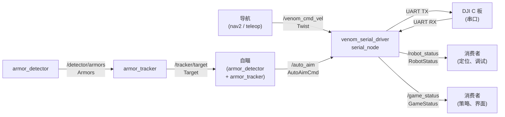

# 话题总览

这里汇总 `venom_vnv` 当前系统中最关键的话题、数据流方向以及自定义消息字段。

## 数据流

---

## 按模块划分的话题

### 遥控输入（`venom_teleop`）

| 方向 | 话题 | 消息类型 | 发布 / 订阅方 | 说明 |
|---|---|---|---|---|
| 发布 | `/venom_cmd_vel` | `geometry_msgs/Twist` | `venom_teleop` | 键盘底盘速度指令。`linear.x/y` 表示平移，`angular.z` 表示底盘旋转。 |

### 串口驱动（`venom_serial_driver`）

| 方向 | 话题 | 消息类型 | 发布 / 订阅方 | 说明 |
|---|---|---|---|---|
| 订阅 | `/venom_cmd_vel` | `geometry_msgs/Twist` | `venom_teleop` / `nav2` | 底盘速度指令。 |
| 订阅 | `/auto_aim` | `venom_serial_driver/AutoAimCmd` | 自瞄控制器 | 云台控制与开火状态，会被合并进发往 C 板的控制帧。 |
| 发布 | `/robot_status` | `venom_serial_driver/RobotStatus` | `serial_node` | C 板回传的机器人状态，包括底盘速度与云台角度。 |
| 发布 | `/game_status` | `venom_serial_driver/GameStatus` | `serial_node` | 比赛状态，包括血量、热量、比赛进程、RFID 等。 |

### 自瞄链路（`rm_auto_aim`）

| 方向 | 话题 | 消息类型 | 发布 / 订阅方 | 说明 |
|---|---|---|---|---|
| 订阅 | `/image_raw` | `sensor_msgs/Image` | 相机驱动 | 原始图像输入。 |
| 订阅 | `/camera_info` | `sensor_msgs/CameraInfo` | 相机驱动 | 相机内参与畸变参数。 |
| 发布 | `/detector/armors` | `auto_aim_interfaces/Armors` | `armor_detector` | 当前帧装甲板检测结果。 |
| 发布 | `/tracker/target` | `auto_aim_interfaces/Target` | `armor_tracker` | EKF 跟踪后的目标状态，包括位置、速度、yaw 与跟踪状态。 |
| 发布 | `/tracker/info` | `auto_aim_interfaces/TrackerInfo` | `armor_tracker` | EKF 调试信息，包括位置残差和 yaw 残差等。 |

### 定位链路（`lio` / `relocalization`）

| 方向 | 话题 | 消息类型 | 发布 / 订阅方 | 说明 |
|---|---|---|---|---|
| 发布 | `/odom` | `nav_msgs/Odometry` | Point-LIO / Fast-LIO | 标准化后的激光惯性里程计输出。 |
| 发布 | `/cloud_registered` | `sensor_msgs/PointCloud2` | Point-LIO / Fast-LIO | 世界系配准点云，`frame_id = odom`。 |
| 发布 | `/cloud_registered_body` | `sensor_msgs/PointCloud2` | Point-LIO / Fast-LIO | 机体系配准点云，`frame_id = base_link`。 |
| 发布 | `/map_cloud` | `sensor_msgs/PointCloud2` | Point-LIO / Fast-LIO | 低频可视化地图点云，`frame_id = odom`。 |
| 发布 | `/path` | `nav_msgs/Path` | Point-LIO / Fast-LIO | 局部积分路径，`frame_id = odom`。 |
| 订阅 | `/livox/lidar` | `livox_ros_driver2/CustomMsg` | Point-LIO / Fast-LIO | Livox 雷达点云输入。 |
| 订阅 | `/livox/imu` | `sensor_msgs/Imu` | Point-LIO / Fast-LIO | LIO 估计器使用的 IMU 输入。 |

---

## 自定义消息字段参考

### `venom_serial_driver/AutoAimCmd`

由自瞄控制器发送给 `serial_node`。所有角度量都使用弧度。

| 字段 | 类型 | 说明 |
|---|---|---|
| `header` | `std_msgs/Header` | 时间戳与 frame id |
| `pitch` | `float64` | 云台 pitch 指令，单位 rad |
| `yaw` | `float64` | 云台 yaw 指令，单位 rad |
| `detected` | `bool` | 当前帧是否检测到目标 |
| `tracking` | `bool` | EKF 是否处于稳定跟踪状态 |
| `fire` | `bool` | 是否允许开火 |
| `distance` | `float64` | 估计目标距离，单位 m |
| `proj_x` | `int32` | 重投影目标像素 x 坐标 |
| `proj_y` | `int32` | 重投影目标像素 y 坐标 |

**C 板控制帧映射关系：**

| `RobotCtrlData` field | Source |
|---|---|
| `lx / ly / lz` | `/venom_cmd_vel` linear.x/y/z |
| `chassis_wz` | `/venom_cmd_vel` angular.z |
| `ay` | `pitch` |
| `az` | `yaw` |
| `flags` bit 0 | `detected` |
| `flags` bit 1 | `tracking` |
| `flags` bit 2 | `fire` |
| `dist` | `distance` |
| `frame_x / frame_y` | `proj_x / proj_y` |

### `venom_serial_driver/RobotStatus`

| 字段 | 类型 | 说明 |
|---|---|---|
| `velocity` | `geometry_msgs/Twist` | C 板回传的底盘线速度与云台角度等信息 |
| `angular_speed` | `geometry_msgs/Twist` | 云台角速度等角运动信息，单位 rad/s |

### `venom_serial_driver/GameStatus`

| 字段 | 类型 | 说明 |
|---|---|---|
| `timestamp_us` | `uint32` | C 板时间戳，单位微秒 |
| `game_progress` | `uint8` | 比赛阶段 |
| `stage_remain_time` | `uint16` | 当前阶段剩余时间，单位秒 |
| `center_outpost_occupancy` | `uint8` | 中央前哨站占领状态标志 |
| `hp_percentage` | `float64` | 当前血量百分比 |
| `shooter_barrel_heat_limit` | `uint16` | 枪口热量上限 |
| `power_management` | `uint8` | 功率管理状态 |
| `shooter_17mm_barrel_heat` | `uint16` | 17mm 枪口当前热量 |
| `shooter_42mm_barrel_heat` | `uint16` | 42mm 枪口当前热量 |
| `armor_id` | `uint8` | 最近一次受击装甲板 ID |
| `hp_deduction_reason` | `uint8` | 最近一次掉血原因编码 |
| `launching_frequency` | `float64` | 当前射频，单位 Hz |
| `initial_speed` | `float64` | 当前弹丸初速，单位 m/s |
| `projectile_allowance_17mm` | `uint16` | 17mm 剩余弹量 |
| `projectile_allowance_42mm` | `uint16` | 42mm 剩余弹量 |
| `rfid_status` | `uint32` | RFID 区域状态位掩码 |
| `distance` | `float64` | C 板测得距离，单位 m |
